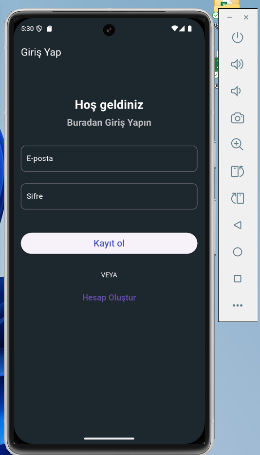
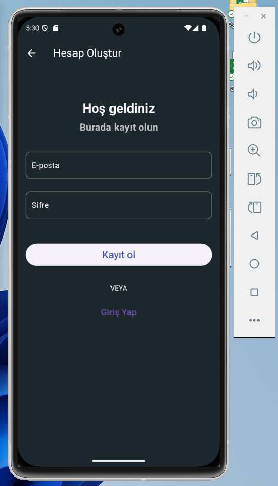
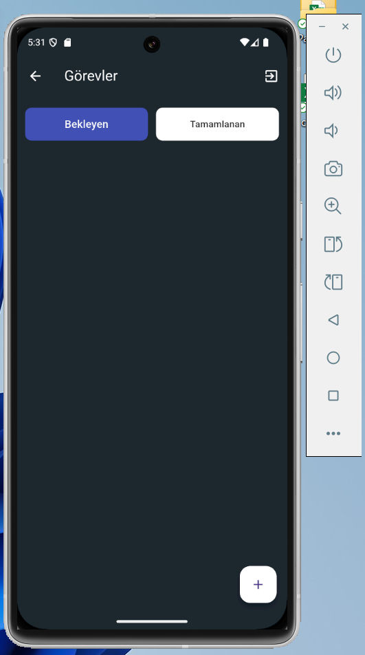
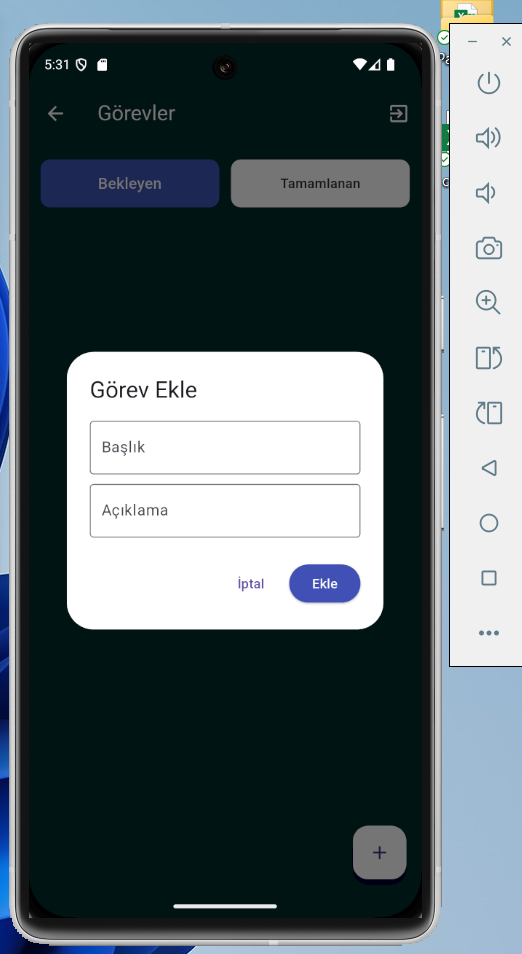
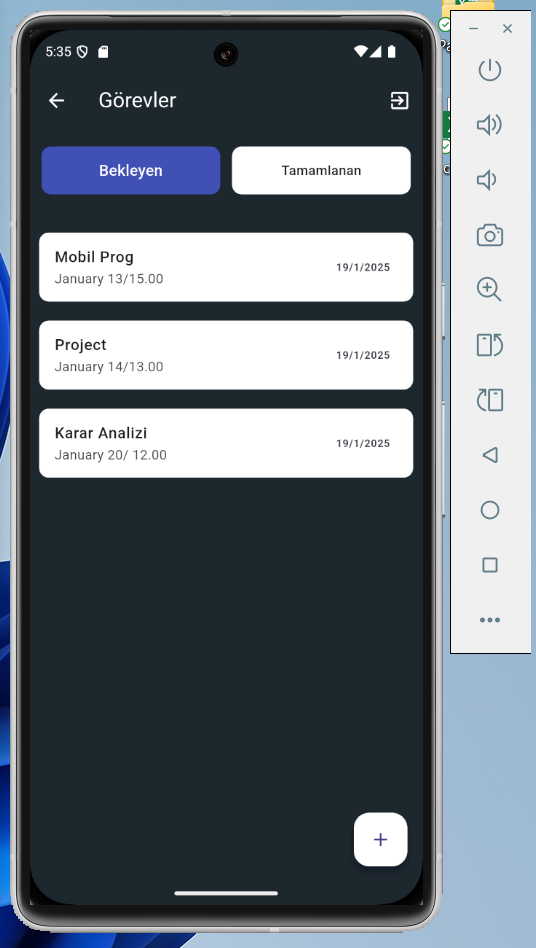
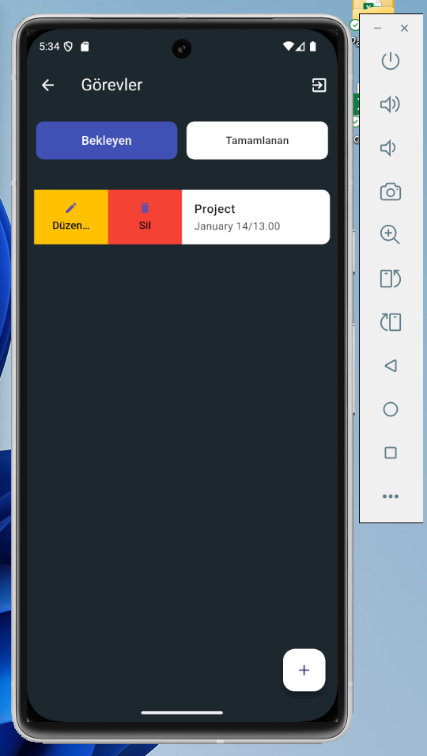
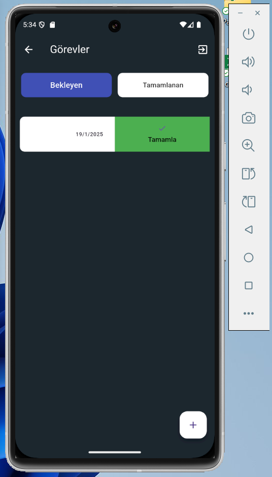
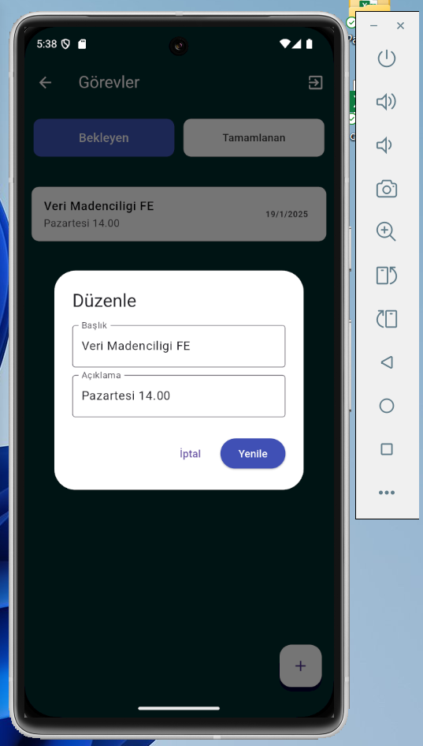
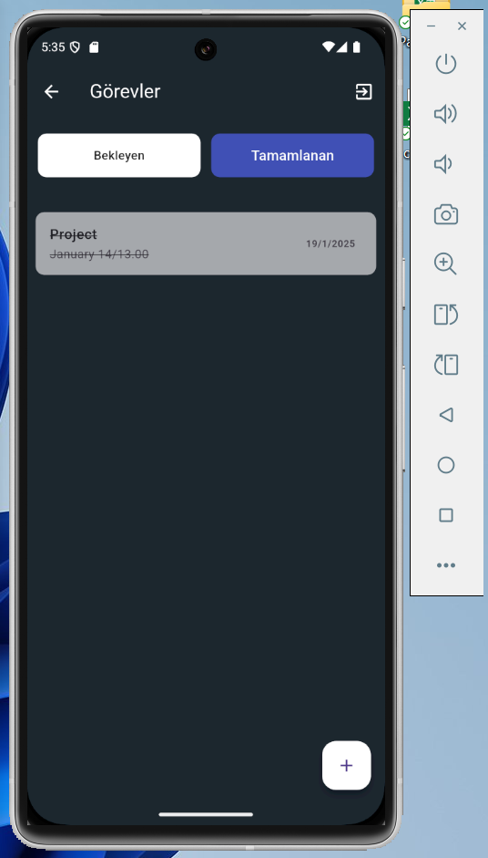
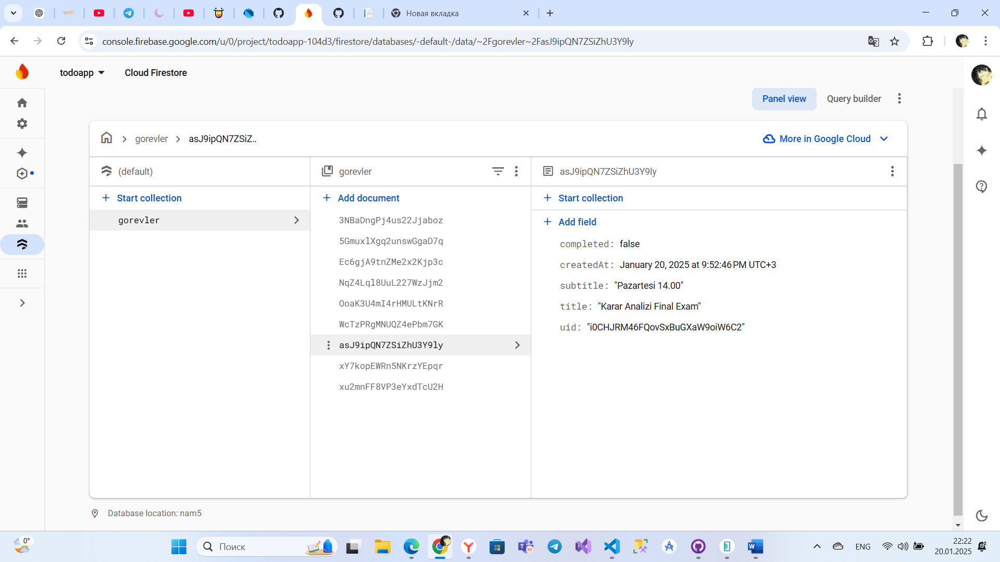

# ToDoApp
 Todo Uygulaması

## Proje Hakkında
ToDoApp, kullanıcıların görevlerini kolayca yönetmelerine olanak sağlayan Flutter ve Dart ile geliştirilmiş bir mobil uygulamadır. Firebase entegrasyonu sayesinde, görevler gerçek zamanlı olarak senkronize edilir ve güvenli bir şekilde saklanır.

## Özellikler
- Görev ekleme, düzenleme ve silme.
- Görev durumunu tamamlandı olarak işaretleme.
- Firebase Firestore ile gerçek zamanlı veri saklama.
- Firebase Authentication ile güvenli kullanıcı giriş/çıkış işlemleri.
- Mobil ve masaüstü cihazlarla uyumlu tasarım.

## Kullanılan Teknolojiler
- **Framework:** Flutter (Dart)
- **Backend:** Firebase Firestore ve Firebase Authentication
- **Araçlar:** Android Studio, Visual Studio Code, Firebase Console, GitHub

## Ekran Görüntüleri
**Kullanıcı girişi:**

  
  

**Ana Ekran:**

**Görev Ekle:**

**Görevler:**

  **Görev düzenleme, görev silme, görev tamamlama:**

  
  
 

**Görev düzenleme:**

  

**Tamamlanan Görevler:**

  

 **Veri Tabanı:**

   
[YouTube Linki](https://youtu.be/yLH91uuMIcw)

## İletişim
Herhangi bir soru veya öneriniz için benimle iletişime geçebilirsiniz:
- GitHub: [esirkepqyzynagi](https://github.com/esirkepqyzynagi)
- E-posta: [132130120@ogr.uludag.edu.tr]
- E-posta: [nagirash@bk.ru]

